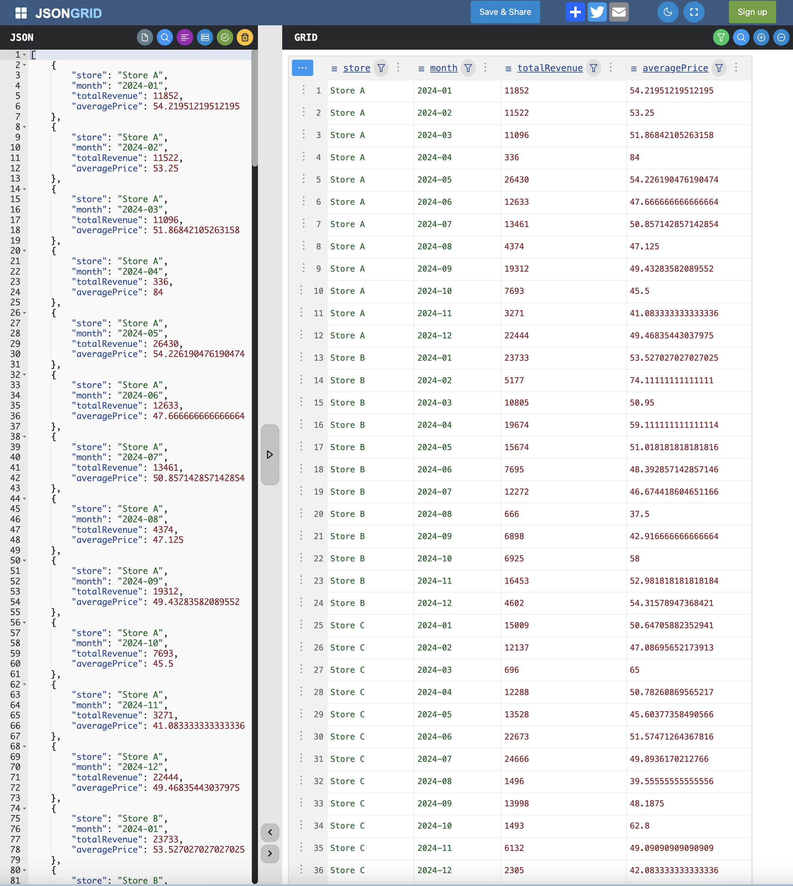

# GraviPIPE: A MongoDB Aggregation Pipeline

This repository is the answer asked for in **Question #3** of the assignment for the role of **Lead MERN Developer** in **Gravity Engineering Services**. It was asked to write a MongoDB Aggregation Pipeline to obtain the desired data output. The `src/pipeline.ts` file is the actual artifact which has been asked for.

The prettified output can be seen below.



### How to run it in your local system?

1. Launch the Docker Daemon Service in your local system.

2. Clone the repository.

```
git clone git@github.com:arkachego/gravipipe.git
```

3. Move inside the `gravipipe` folder.

```
cd gravipipe
```

4. Install the dependencies.

```
npm install
```

5. Launch the MongoDB docker container.

```
npm run mongo:start
```

6. Populate the dummy data into the database.

```
npm run mongo:insert
```

7. Execute the pipeline written in the `pipeline.ts` file.

```
npm run mongo:pipeline
```

The `outputs.json` file should be generated in the root directory.